# **Ubuntu Lamp Stack Implementation on AWS**

## **What is a LAMP Stack**

A LAMP stack is a commonly used set of software components that together provide a platform for building and hosting dynamic websites and web applications. The name "LAMP" is an acronym for the four key components that make up the stack: Linux, Apache, MySQL, and PHP/Perl/Python (usually referred to as PHP).

## **Overview of each component of the LAMP Stack**

#### *Linux*
The operating system that serves as the foundation of the stack. It provides the environment for running the other components and managing hardware resources.

#### *Apache*
A popular open-source web server software that listens to incoming HTTP requests from clients (web browsers), processes those requests, and serves web content (HTML, CSS, JavaScript, etc.) back to the clients. It's responsible for handling the communication between the server and the client's browser.

#### *MySQL*
A widely used open-source relational database management system (RDBMS) that manages and stores structured data. MySQL is crucial for storing and retrieving data for web applications, making it possible to create dynamic websites that interact with databases.

#### *PHP/Perl/Python*
These are scripting languages used to develop dynamic web content and applications. In the context of the LAMP stack, PHP is the most common choice. PHP scripts are embedded within HTML and executed on the server side. They generate dynamic content that's sent to the client's browser as HTML, allowing for interactive and data-driven web applications.

## A. **Setting up  and Connecting to Ubuntu VM**
Step 1: Log in to aws and create an ubuntu ec2 instance. 

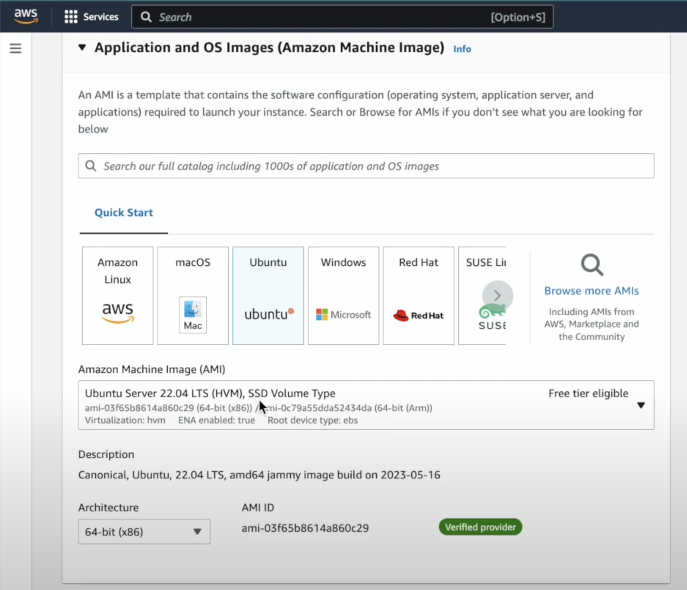

Instance Created!

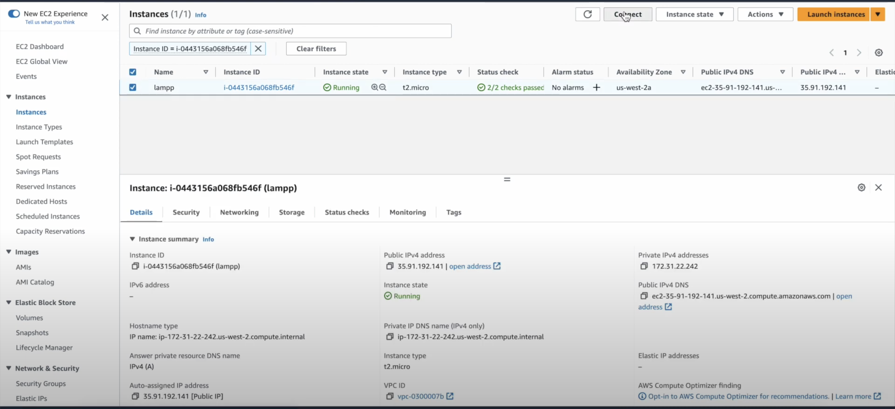

Step 2: Connect to Ubuntu Instance using Instance Connect.

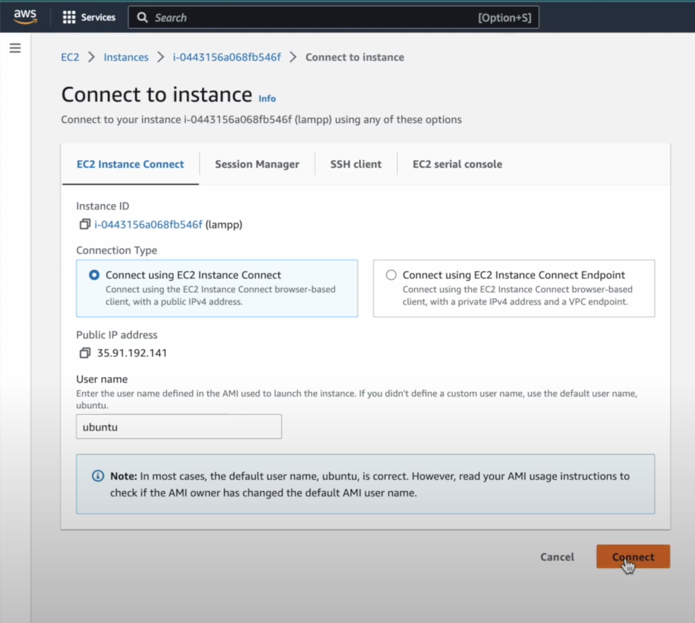

Connection Successful!

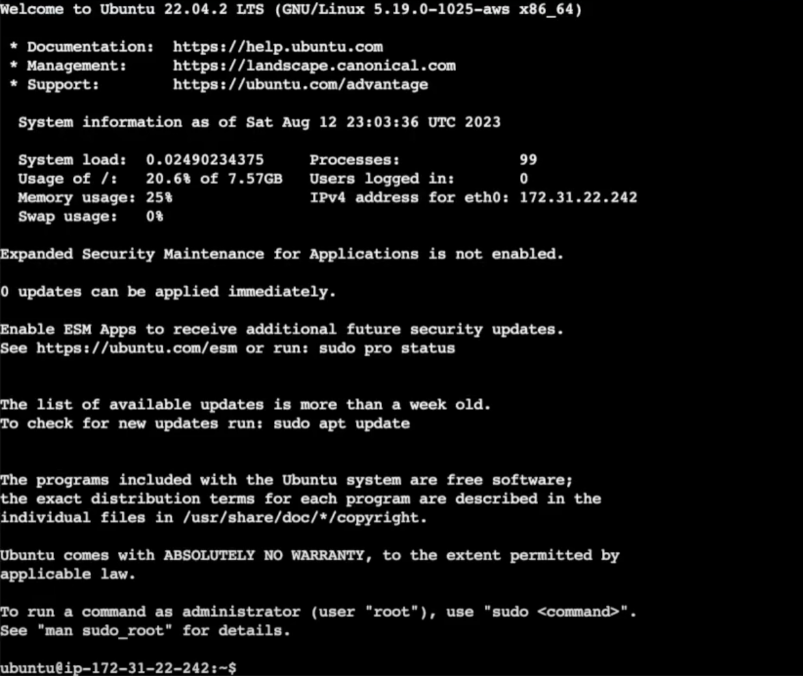


## B. **Install Apache**
Step 3: Update the package repository by running `sudo apt update`

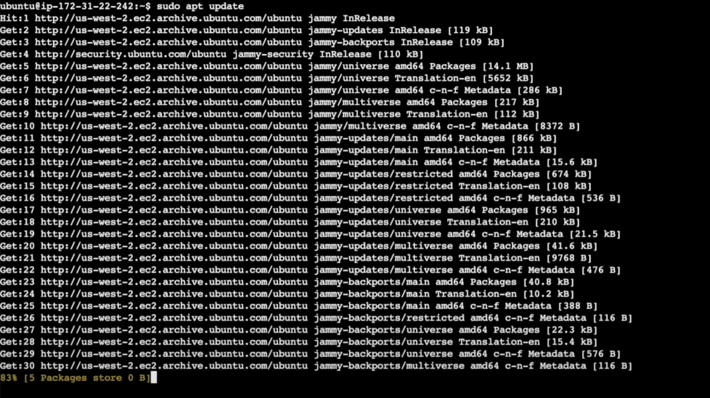

Step 4: Install Apache by running `sudo apt install apache2`

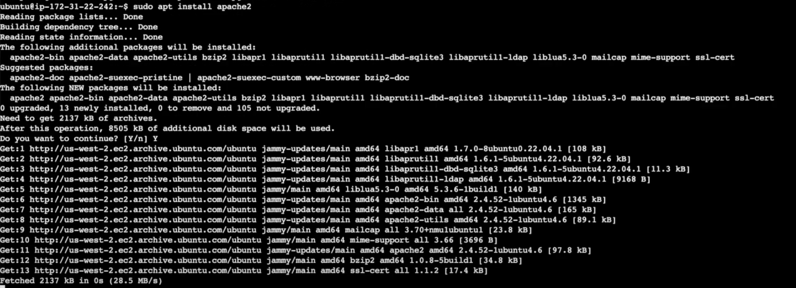

Step 5: Verify Apache is running by running `sudo systemctl status apache2`.
If you see a green colored "active(running)", Apache successfully insstalled and started on port 80!.

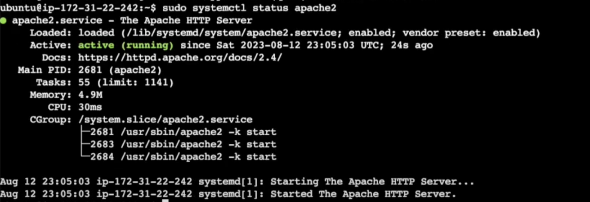

Step 6: Open a web browser of your choice (Chrome recommended), navigate to "http://Public-IP-Address-of-ec2:80"

If you see the page below then your web server is correctly installed and accessible through the firewall.

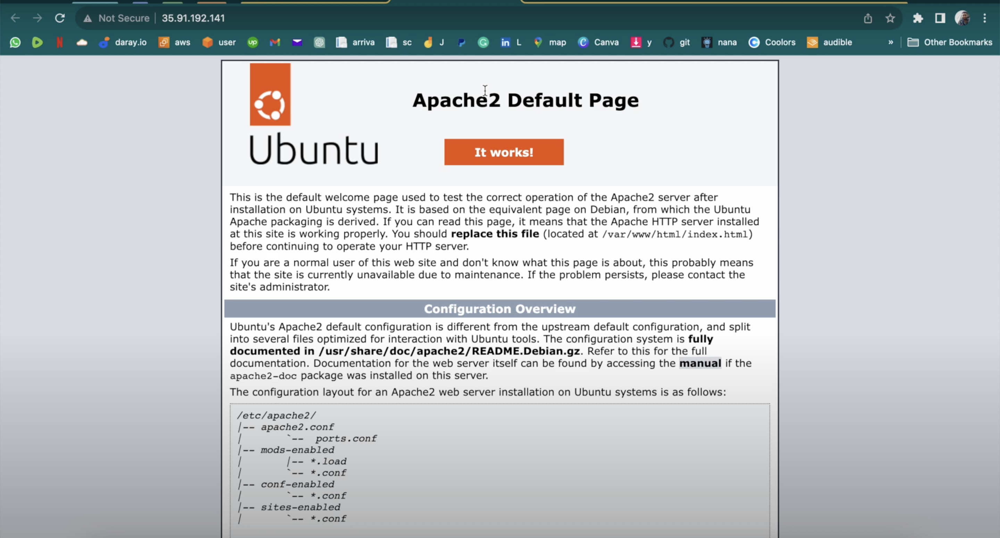


## C. **Install MYSQL**
Step 7: Use apt to install mysql-server by running `sudo apt install mysql-server`

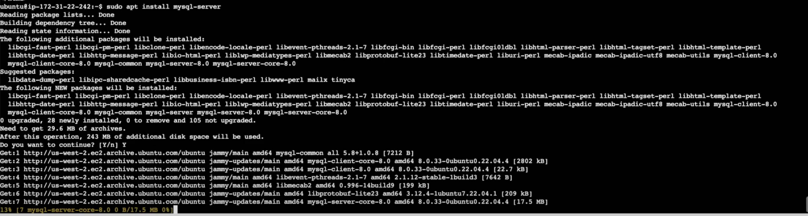

Step 8: Log in to mysql console by running `sudo mysql`

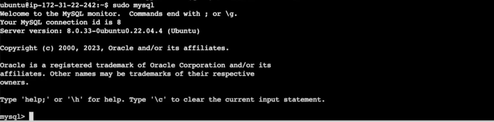

Step 9: Set password for mysql root user by running `ALTER USER 'root'@'localhost' IDENTIFIED WITH mysql_native_password BY 'PassWord.1';`

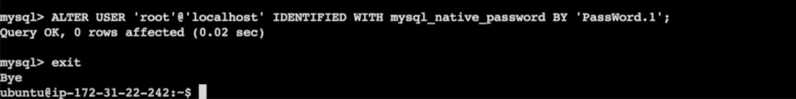

Step 10: Open a web browser of your choice (Chrome recommended), navigate to "http://Public-IP-Address-of-ec2:80"

If you see the page below then your web server is correctly installed and accessible through the firewall.


Code block:

```python
def greet(name):
    print(f"Hello, {name}!")

greet("Alice")

